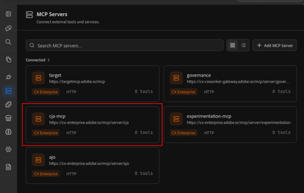

# Adobe Customer Journey Analyticsのデータを分析する（チャット）

Adobe Adobeの共同作業チャット機能は、以前はAnalysis Workspaceでのみ可能だった高度なデータ分析を実行できます。 Coworker Chatは、Customer Journey Analyticsのデータビューからデータにアクセスし、そのデータを検索して、自然言語プロンプトに対する回答を得ることができます。

Coworker Chatは、必要な分析に応じて、次の2つの方法で使用できます。

* **簡単な回答** – 直接の平易な言葉で質問すると、すぐに回答が得られます。 ビジネスユーザーはこの方法でCoworker Chatを使用することが多く、アナリストは関係者に迅速な回答が必要な場合にも使用します。
* **深く考える作業** - ビジネス上の問題を調査し、原因を除外し、推奨事項に到達するために、Coworker Chatと拡張された複数回の会話を行います。 アナリストは通常、このアプローチを利用して、レコメンデーションの前にデータを詳細に分析します。

分析を開始する前に、Coworker Chat インターフェイスと設定オプションについて説明し、CoworkerがCustomer Journey Analyticsと、使用するデータを含むデータビューに接続されていることを確認します。

## 同僚とのチャットを始める

### データアクセスと権限

Coworker Chatは、Customer Journey Analyticsから権限を継承します。 Analysis Workspaceで使用できるデータビュー、ディメンション、指標、セグメントのみにアクセスできます。

### インターフェイスと設定オプション

Customer Journey Analytics データでCoworker Chatを使用する前に、ログインして次の機能の設定オプションを管理する方法について説明します。

* チャット入力
* 会話
* マーケットプレイス
* MCP サーバー
* メモリ
* プラグイン
* スキル
* その他

詳しくは、[同僚チャット UI ガイド ](/help/coworker/chat/ui-guide.md)を参照してください。

### 同僚とのチャットでデータを分析する際のベストプラクティス

#### 組織レベルのベストプラクティス

* 自社のアナリストをCoworker Championとして任命します。

* 利用者が利用できるデータやコンポーネントに関連する、プロンプトやスキルのライブラリを作成できます。

* 分析で使用するコンポーネントのみを使用するように、共同作業者チャットを指示する1つ以上のスキルを作成します。 これにより、同僚とのチャットにより、組織内のユーザーに最も関連性の高いデータを提供できます。

* Coworker Chatに質問して簡単に回答を得られるタイミングと、深く考えた作業に使用できるタイミングをユーザーに提供します。

#### ユーザーレベルのベストプラクティス

* プランモードを使用します。 これは、複雑なタスクに特に役立ちます。同僚がアクションを起こす前にフォローアップで質問できるため、単純なタスクでも優れた結果を得ることができます。 詳しくは、[ プランモード ](/help/coworker/chat/ui-guide.md#plan-mode)を参照してください。

* プロンプトを作成する際には、できるだけ具体的に次のように記述します。

  * 分析するディメンション、指標、日付範囲に名前を付けます。
  * ディメンション、指標、セグメントなどの参照データビューコンポーネントを、正確な名前で呼び出します。
  * 含める、除外、比較するセグメント、オーディエンス、チャネル、デバイスを指定します。
  * Funnel、トレンド、コホートテーブルなど、特定のビジュアライゼーションタイプを設定するかどうかを指定します。
  * 同僚チャットでフォローアップの質問を提案する場合は、次のステップの推奨を尋ねます。
  * 指標を予測する際に、「今後30日間」などの予測範囲を求めます。
  * 既存の仮説を記載しておくことで、Coworker Chatで検証したり、除外したりできます。
  * 指標の変更の内訳が必要な場合は、貢献度ディメンションを尋ねます。
  * 経営陣やマーケティング部門などの概要に対してオーディエンスを指定し、調査結果を提示する場合は、スライドデッキの概要をリクエストします。
  * データの検証時に比較する特定のレポートスイートとデータビューに名前を付けます。
  * まず分析を完了し、次にCoworker Chatにスキルとして保存してもらいます。その際、わかりやすい名前を付け、どのくらいの頻度で再利用する予定かを書き留めます。

* Coworker Chat メモリに標準的な方向を追加します。 例えば、常に同じデータビューのデータを使用する場合は、それをメモリに追加します。

## Workfront ChatがCustomer Journey Analyticsに接続されていることを確認します

Coworker Chatで、CoworkerがCustomer Journey Analyticsに接続されていることを確認します。

1. 左側のパネルで「MCP」アイコンを選択し、接続されているMCP サーバーのリストで&#x200B;[!UICONTROL **cja-mcp**]&#x200B;が使用可能であることを確認します。

   

1. （条件付き） [!UICONTROL **cja-mcp**]&#x200B;がまだ接続されていない場合は、[!UICONTROL **MCP Server**]&#x200B;を追加を選択し、[!UICONTROL **サーバー名**] フィールドにcjaを指定して、表示されたら選択し、[!UICONTROL **サーバー**]&#x200B;を追加を選択します。

## 適切なデータビューへの接続

データビューとは、データの解釈方法を決定するCustomer Journey Analyticsのコンテナです。

Customer Journey Analyticsでは、さまざまなデータビューにアクセスでき、それぞれに異なるディメンションと指標が含まれており、データを分析する際に利用することができます。

### 使用するデータビューを決める

同僚に、回答したい質問の種類を伝え、その情報を提供するのに最適なデータビューにアクセスできるかどうかを尋ねます。 また、[ データビューをメモリ ](#add-a-data-view-preference-in-memory)の環境設定として設定することもできます。

**あなた：**

>[!BEGINSHADEBOX]

カスタマージャーニーのどこで顧客が脱落しているのかを把握したい。 Customer Journey Analyticsのどのデータビューにアクセスすれば、この質問に答えることができますか？

>[!ENDSHADEBOX]

**同僚チャット応答：**

>[!BEGINSHADEBOX]

3つのデータビューにアクセスできます。 `Customer lifecycle` データビューには、次のディメンションと指標が含まれており、質問に答えるのに最適です。

>[!ENDSHADEBOX]

**あなた：**

>[!BEGINSHADEBOX]

では、そのデータビューを使ってみましょう。

>[!ENDSHADEBOX]

**同僚チャット応答：**

>[!BEGINSHADEBOX]

さて、このチャットセッションでの今後の質問に答えるために`Customer lifecycle` データビューを使用します。

>[!ENDSHADEBOX]

### メモリにデータビューの環境設定を追加する

Coworker Chatには、すべてのチャットにまたがる情報へのアクセスを提供できるメモリ機能が含まれています。 同僚のメモリに、好みのデータビューを好みのデータビューとして追加することをお勧めします。

1. Coworker Chatの左側のナビゲーションで、「メモリ」アイコンを選択します。

1. メモリーページの&#x200B;[!UICONTROL **保存された環境設定**] セクションで、Coworker Chatでチャットで使用する1つ以上のデータビューを指定します。

   

## Customer Journey Analytics での分析

Coworkerがビジュアライゼーションを作成した後、Customer Journey AnalyticsのAnalysis Workspaceでビジュアライゼーションを開くと、より詳細なコントロールを使用してより詳細な分析を行うことができます。 Customer Journey Analyticsの新しいAnalysis Workspace プロジェクトでビジュアライゼーションが開きます。

新しいAnalysis Workspace プロジェクトでビジュアライゼーションを開くには：

1. Coworkerで作成されたビジュアライゼーションの横にある「[!UICONTROL **CJAで分析**]」を選択します。

1. Customer Journey Analyticsでビジュアライゼーションを開くと、Analysis Workspaceのドラッグ&amp;ドロップ操作のブラウザーインターフェイスを使用して変更を加えたり、分析をさらに細分化したり、オーディエンスを作成したりできます。 Workspaceプロジェクトは、誰とでも共有できます。

   Analysis Workspaceについて詳しくは、[Analysis Workspaceの概要](https://experienceleague.adobe.com/ja/docs/analytics-platform/using/cja-workspace/home)を参照してください。

### Customer Journey Analyticsのユースケース

Adobe Customer Journey Analyticsのユースケースと、実務担当者がAdobe CX Enterprise Coworker Chatで使用しているプロンプトの例を、簡単な回答から高度な作業の調査まで確認できます。 各プロンプトは、コピーできるように構築され、独自のデータやコンテキストに適応させ、会話を通じて洗練させられます。

詳しくは、[ ユースケース ](/help/coworker/chat/use-cases.md)を参照してください。

## 分析のスキル

Customer Journey Analytics データの分析には、次のスキルを使用できます。

### データのクエリと分析

このスキル （`cja`）を使用すると、Analysis Workspaceで自分でリクエストを作成することなく、Customer Journey Analyticsをリアルタイムでクエリし、結果を分析できます。

#### 必要な権限

* クエリするデータビューへのアクセス権を表示します

#### 主なユースケース

| ユースケース | 関数 | サンプルプロンプト |
|---------|----------|---------|
| **レポートと指標を取得** | Customer Journey Analyticsにリアルタイムでクエリを実行し、指標、ディメンション、セグメント、データビューを取得します。 | <ul><li>「過去30日間のページビューを表示」</li><li>「マスターデータビューの上位セグメントのリスト」</li></ul> |
| **比較分析** | チャネル、期間、セグメントをまたいで指標を並べて比較できます。 | <ul><li>「チャネル別の収益を月々比較」</li><li>「モバイル版とデスクトップ版のコンバージョンは、今四半期でどのように見えますか？」</li></ul> |
| **Funnel analysis** | 各ステージで離脱するマルチステップのコンバージョンファネルを順を追って進めます。 | <ul><li>&quot;チェックアウトfunnelを通して私を歩く&quot;</li><li>「PDPから購入へのコンバージョンfunnelの表示」</li></ul> |
| **予測** | 過去データにもとづいて、将来の指標値を予測。 | <ul><li>「今後30日間のセッションを予測」</li><li>「売上目標を達成する準備は整っていますか？」</li></ul> |

#### スコープ内

* 指標、ディメンション、セグメント、データビューのリアルタイムのクエリ
* チャネル、期間、セグメントをまたいだ比較を並べて表示
* マルチステップのfunnelとフォールアウト分析
* 過去の傾向にもとづく指標予測

#### 範囲外

* データビューコンポーネントの作成または編集
* アクセスできるデータビュー以外のデータ
* 指標予測を超えた予測モデリング

### 根本原因分析

このスキル （`cja-root-cause-analysis`）は、指標が変更されたことを報告するだけでなく、変更された理由を調査します。

#### 必要な権限

* 分析中のデータビューへのアクセスを表示します

#### 主なユースケース

| ユースケース | 関数 | サンプルプロンプト |
|---------|----------|---------|
| **指標の変更を診断** | 低下、急増、異常値など、指標が変化した理由を調査します。 | <ul><li>「先週、コンバージョンが下がったのはなぜですか？」</li><li>「1月15日の売上の急増の原因は何ですか？」</li></ul> |

#### スコープ内

* 既知の期間における既知の指標の変化の調査
* 変化に貢献したディメンションとセグメントを提示

#### 範囲外

* 質問していない異常の検出（自動化されたアラートやリアルタイムのアラートはない）
* アクセス可能なデータビュー外の指標の根本原因分析

### 経営陣向けのサマリーとパフォーマンスダイジェスト

このスキル （`cja-executive-summary`）は、Customer Journey Analytics データの関係者に対応した概要を生成します。

#### 必要な権限

* 概要で説明されているデータビューまたはデータビューへのアクセスを表示する

#### 主なユースケース

| ユースケース | 関数 | サンプルプロンプト |
|---------|----------|---------|
| **パフォーマンスの概要** | 関係者に提供可能なパフォーマンスの要約、処方レコメンデーション、スライドデッキの概要を作成します。 | <ul><li>「先月の概要を教えてください」</li><li>「今四半期のデータからスライドデッキのアウトラインを作成する」</li></ul> |

#### スコープ内

* 指定した期間のパフォーマンスの要約
* データに基づいた処方的推奨事項の生成
* スライドデッキや関係者が読み上げる内容の概要

#### 範囲外

* 最後のスライド デッキまたはプレゼンテーション ファイルの作成
* アクセスできないデータビューにまたがる要約

### Adobe Analyticsによるデータ検証

このスキル （`aa-cja-validation`）は、[!DNL Adobe Analytics]とCustomer Journey Analytics間のデータを比較、監査、調整します。

#### 必要な権限

* [!DNL Adobe Analytics] レポートスイートと比較されるCustomer Journey Analytics データビューへのアクセスを表示します

#### 主なユースケース

| ユースケース | 関数 | サンプルプロンプト |
|---------|----------|---------|
| **Adobe AnalyticsからCustomer Journey Analyticsへのアップグレード時にデータを検証** | [!DNL Adobe Analytics]とCustomer Journey Analytics間のデータの比較、監査、調整を行います。
詳しくは、「[Adobe AnalyticsからCustomer Journey Analyticsにアップグレードする際にCoworkerでデータを検証する](/help/coworker/data-validation-aa-cja.md)」を参照してください。
 | <ul><li>「Adobe Analytics レポートスイートとCustomer Journey Analytics データビューの比較」</li><li>「Adobe AnalyticsとCustomer Journey Analytics間のページビューの検証」</li></ul> |

#### スコープ内

* レポートスイートとデータビュー間の指標値の比較
* 2つのデータソース間の不一致のフラグ付け

#### 範囲外

* データの不整合の根本的な原因を解決する
* [!DNL Adobe Analytics]およびCustomer Journey Analytics以外のデータソースを検証しています

### カスタムスキルの作成

このスキル （`cja-skill-creator`）は、既に実行した分析を、セッション間で保持される再利用可能なスキルに変換します。

#### 必要な権限

* スキルの管理、再利用可能なスキルの保存

#### 主なユースケース

| ユースケース | 関数 | サンプルプロンプト |
|---------|----------|---------|
| **再使用可能な分析パターン** | 分析パターンを、セッションをまたいで保持される、再利用可能で反復可能なスキルに変換します。 | <ul><li>「この週次の収益分析を再利用可能なスキルに変える」</li><li>「funnelの月次レポート用のスキルとして保存」</li></ul> |

#### スコープ内

* 完了した分析を、名前付きの再利用可能なスキルに変換する
* 保存されたスキルを今後のチャットセッションで利用できるようにします

#### 範囲外

* 保存したスキルを他のユーザーと自動的に共有する（組織レベルのスキルライブラリには管理者の設定が必要）
* スキルが参照するデータビューコンポーネントの編集

## 例：顧客の脱落する箇所の特定

ビジネス上のあらゆる質問を分析するために、データを使用するようにCoworker Chatに依頼できます。

たとえば、マーケティングマネージャー、マーチャンダイザー、グロース担当者は、顧客がどこで購入への道筋を放棄したのか、なぜ離脱したのか、コンバージョン率を高めるために何ができるかを把握する必要があります。

>[!NOTE]
>
>以下の図は、架空のretailer [!DNL TechPulse Electronics]のサンプルデータを示しています。このデータは、会話の形を示すために使用されます。

### 質問の種類

「フォールアウトビジュアライゼーション」とは何か、またどの指標がどのスロットに入るかを知る必要はありません。 重視する結果を平易な言葉で記述しましょう。

* 「どこで買い物に行く途中で人々を失っているのか？」
* 「商品ビューからチェックアウトまで、funnelのコンバージョン率はいくらですか？」
* 「カートと購入の間に最もリークするマーケティングチャネルはどれですか？」
* 「モバイルやデスクトップでのカート放棄の状況は悪化していますか？」
* 「有料ソーシャル広告の人々は、メールの人々とは異なるコンバージョンになりますか？」

### 会話

#### &#x200B;1. ビジネス上の課題から始めましょう

**あなた：**

>[!BEGINSHADEBOX]

購買に至る過程で顧客が失っている場所はどこか？

>[!ENDSHADEBOX]

**同僚チャット応答：**

同僚とのチャットでは、適切なビジュアライゼーションの選択、顧客接点のシーケンス化、さらには推奨される次のステップの追加などが可能です。

>[!BEGINSHADEBOX]

これはfunnelの質問です。funnelでコンバージョンを実行し、購入に至るまでの過程で離脱がどこで発生するかを確認します。

顧客を失う原因：

| Funnel ステップ | カウント | 次へのコンバージョン | 脱落 |
| --- | --- | --- | --- |
| Sessions | 137,476 | 45.0%が商品を閲覧 | 55%の企業が商品を閲覧せずに離脱 |
| 製品ビュー | 61,845 | 55.0% カートに追加 | 45%参照するが追加しない |
| 買い物かごに追加 | 34,045 | 16.4%購入 | 83.6% カート放棄 |
| 購入 | 5,582 | — | — |

**大きな発見：買い物かごはあなたの最大の漏れです**

28,463人が商品をカートに入れたが、購入を完了しなかった。 これは83.6%のカートから購入までのドロップオフ率であり、失敗のシングルポイントとして圧倒的に大きい数値です。

**優先事項について説明します：**

| 優先度 | 問題点 | 機会の規模 |
| --- | --- | --- |
| #1 | 買い物かごからの放棄（83.6%減少） | 28,463人のバイヤーが離脱 |
| #2 | 製品ビューへのセッション（55%が閲覧しない） | 75,631件のセッション（製品エンゲージメントなし） |
| #3 | 商品ビューをカートに追加（45%が追加不可） | 2万7,800人に関心があるもののコミットしていない |

**次の手順の推奨：**

1. マーケティングチャネルごとにカートの放棄を分解する – 特定のチャネルは、カートに追加するものの、購入することはない、低意図のトラフィックをもたらしていますか？
1. デバイスタイプごとにカート放棄を検証する – モバイルチェックアウトはコンバージョンを妨げるのでしょうか？
1. 最も放棄される製品を特定する（価格の問題）? 配送サプライズ？

**次に掘り下げたいのはどれですか？** チャネルの内訳を確認すれば、「ほぼ購入者」と実際の購入者のどちらが多いマーケティング活動をもたらすかを直接把握できます。

>[!ENDSHADEBOX]

#### &#x200B;2. リークをドリルインする

**あなた：**

>[!BEGINSHADEBOX]

続いて、マーケティングチャネルごとに説明します

>[!ENDSHADEBOX]

**同僚チャット応答：**

>[!BEGINSHADEBOX]

マーケティングチャネル別にコンバージョン率とドロップオフを示す

カスタム **マーケティングチャネル** ディメンションがあります。 ここでfunnelを引き出して、チャネルごとのコンバージョン率を計算し、各チャネルがリークする場所を特定します。

**評決：漏洩がチャネル固有ではありません**

これは本当に明らかな発見です。 Funnelのチャネルごとの内訳は次のとおりです。

| チャネル | Sessions | 製品ビュー | カートに追加するには | 購入手続き | 全体的なコンバージョン | 収益/セッション |
| --- | --- | --- | --- | --- | --- | --- |
| 有料検索 | 43,958 | 45.1% | 54.6% | 16.6% | 4.09% | $499.58 |
| オーガニック検索 | 31,492 | 44.9% | 54.9% | 16.9% | 4.17% | $494.76 |
| ダイレクト | 25,245 | 43.6% | 55.4% | 15.8% | 3.82% | $497.29 |
| 電子メール | 17,586 | 45.3% | 55.4% | 16.2% | 4.07% | $501.13 |
| ソーシャル広告 | 12,684 | 45.4% | 55.7% | 16.0% | 4.03% | $512.17 |
| 表示 | 6,511 | 45.3% | 55.7% | 16.2% | 4.09% | $501.45 |

**重要ポイント：**

1. 買い物かごから購入までのドロップオフは、あらゆるチャネルで一様に悪くなっています（83～84%）。 つまり、問題はトラフィックの質にあるのではなく、あらゆるチャネルが同様の速度で顧客をカートにコンバージョンしていることを意味します。 そうしたリスクは、マーケティング部門ではなく、決済体験そのものに存在します。
1. コンバージョン率が大幅に向上または低下したチャネルはない。 全体のコンバージョン率は3.8%から4.2%の間で非常に高く、セッションあたりの売上はほぼ同じです（495 ドルから512 ドル）。
1. 配信数が最も重要な場所：有料検索で最も多くの顧客が失われ（9,015件のカート放棄）、次いでオーガニック検索（6,449件のカート放棄）となっています。 トラフィックを最も促進する最大の収益機会です。

**戦略的に何を伝えるか**

マーケティングチャネルは本来の役割を果たしています。人々の関心を惹き、カートへの追加を同程度のスピードで進めています。 問題はマーケティングの下流にあります。チェックアウトと支払いの流れは現金が漏れている場所です。

**次の調査の推奨：**

1. 商品カテゴリーごとにモバイルカートの放棄を分類する – 高価格商品では悪化しますか（モバイル決済の信頼に関する問題が発生することを示唆しています）?
1. 最もモバイルトラフィックを促進しているマーケティングチャネルは何か？有料の広告費をモバイルfunnelに誘導しているチャネルは何か？
1. ページやサイトセクションのシグナルがあるかどうかを確認する – モバイルユーザーが放棄する前に最後にアクセスしたチェックアウトページを確認できるか？

**次にどの角度を探索しますか？**

>[!ENDSHADEBOX]

#### &#x200B;3. 調査を継続

**あなた：**

>[!BEGINSHADEBOX]

興味を引く： デバイスの種類ごとに分類してみましょう。

>[!ENDSHADEBOX]

**同僚チャット応答：**

>[!BEGINSHADEBOX]

デバイスの種類](./assets/coworker-funnel-response3.png)別にコンバージョン率とドロップオフを示す![Funnel テーブル

**見つかりました：モバイル チェックアウトが壊れています**

Funnelは、決済プロセスが完了するまで端末をまたいで同じ機能を提供します。その後、モバイルは崖から落ちます。

| デバイス | Sessions | 製品ビュー | カートに追加するには | 購入手続き | 全体的なコンバージョン |
| --- | --- | --- | --- | --- | --- |
| Desktop | 70,172 | 44.9% | 54.8% | 23.2% | 5.70% |
| タブレット | 13,855 | 44.7% | 55.6% | 14.3% | 3.56% |
| モバイル | 53,449 | 44.9% | 55.3% | 8.1% | 2.02% |

**喫煙銃**

| 指標 | Desktop | モバイル | 間隔 |
| --- | --- | --- | --- |
| カートから購入率 | 23.2% | 8.1% | 15% ポイント |
| モバイル | — | 2.8倍悪い | — |
| カート放棄 | 13,274 | 12,178 | ほぼ同じ絶対量 |

モバイルデバイスでの閲覧とカートへの追加体験は良好です（閲覧率は約45%、カートへの追加率は約55%）。 人々は同じように興味を持ち、熱心です。 しかし、モバイルのチェックアウトフローにコンバージョンの原因があることに気がつきました。

**収益機会**

モバイルチェックアウトのコンバージョン率がPCと同程度であれば、追加購入者数は約1,991人に上ります。これは、エクスペリエンスを修正することで、総購入量が35%増加します。

**起こりそうなことについて**

データパターン（等しいエンゲージメント、壊滅的なチェックアウトドロップ）は、次のような古典的なシグナルです。

* 小さな画面で支払いフォームが処理しにくい（自動入力の問題、フォームレイアウト）
* チェックアウト時に明らかになった予想外のコスト（送料、税金）がステッカーショックの原因になります
* ゲストチェックアウトが利用できない、またはモバイルのログインウォールがある
* モバイルでの決済処理中にページの読み込みまたはタイムアウトが発生する

**次の手順の推奨：**

1. 商品カテゴリーごとにモバイルカートの放棄を分類する – 高価格商品では悪化しますか（モバイル決済の信頼に関する問題が発生することを示唆しています）?
1. 最もモバイルトラフィックを促進しているマーケティングチャネルは何か？有料の広告費をモバイルfunnelに誘導しているチャネルは何か？
1. 「holiday_flash_sale」キャンペーンのチェックアウトコンバージョン率が向上したかどうかを確認します。緊急性を重視したキャンペーンでは、チェックアウトのつまずきを克服できます

**どちらを調査しますか。それとも、UX チームとチェックアウト チームに伝えるのに十分な証拠ですか？**

>[!ENDSHADEBOX]

#### &#x200B;4. 決定に変換

**あなた：**

>[!BEGINSHADEBOX]

では、どうすればよいでしょうか？

>[!ENDSHADEBOX]

**同僚チャット応答：**

>[!BEGINSHADEBOX]

データから分かるように、次のことに注力します。

* **モバイル チェックアウトを修正します。チャネルの問題ではありません。** あらゆるチャネルで、オーディエンスが同様の健全な割合でカートに入れるようにしているため、広告費は全体的に効果を発揮しています。 売上は、修正の対象となるモバイルチェックアウトフローにおいて失われています。
* **支払いとフォームの摩擦を開始します。** これらは、購買意欲の高いモバイル顧客がカートを放棄する最も一般的な理由です。 通常、モバイルウォレットのオプションを提供し、フォームを短縮することが最速の成果です。
* **修正後に再度確認します。** チェックアウトが完了したら、モバイルのカートから購入への割合が、デスクトップの23.2%に上昇するかどうかを確認します。

これをプロジェクトとして保存して追跡できるようにするのか、モバイルカートから購入までのしきい値を下回った場合にアラートを設定するのか？

>[!ENDSHADEBOX]

### 何が起こったのか

平易な言葉で言える4つの質問があり、Coworkerがサポートしてくれました。

* マルチステップのコンバージョンを構築するfunnelでは、最大のリークとしてカートから購入へとフラグを立てます
* 原因としてマーケティングチャネルを除外：あらゆるチャネルでのリーク率はほぼ同じです
* 実際の問題をモバイルでのチェックアウトに分離し、その解決方法を購入額の35%向上で定量化します
* モバイル決済やフォームでのつまずきなど、特定の修正を優先しましょう。 これは、デスクトップのコンバージョン率が23.2%であることを基準としています
