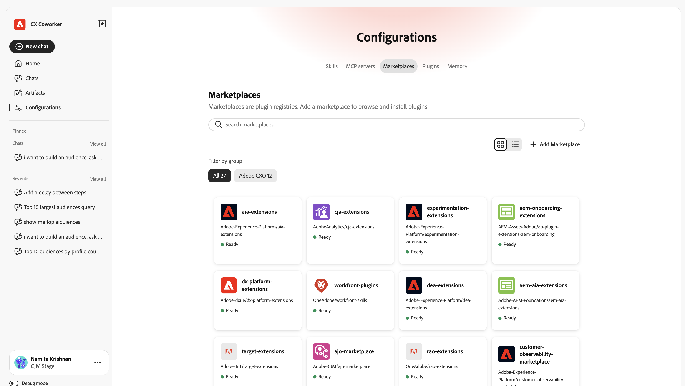

# UI ガイド {#ui-guide}

同僚とのチャットインターフェイスを使って方向性を定める。 このガイドでは、アプリにアクセスしてワークスペースをナビゲートする方法から、会話を最大限に活用する方法、履歴を管理する方法、設定をカスタマイズする方法まで、すべてを説明します。

## 同僚とのチャット

[https://experience.adobe.com/#/coworker](https://experience.adobe.com/#/coworker)に移動し、Adobeの資格情報でログインして、共同作業者チャットにアクセスします。

また、CX Enterpriseの上部ヘッダーのアプリケーションセレクターから&#x200B;**Coworker**&#x200B;を選択してアクセスすることもできます。

## 組織とサンドボックスの選択

現在のコンテキストは、左側のナビゲーションパネルの下部の名前とプロファイル画像の下に表示されます。 コンテクストによって、会話を通じてリーチできるデータ、スキル、連携ツールが決まります。まずは、そのデータやスキルを確認しましょう。

名前を選択してアカウントメニューを開き、コンテキストを切り替えてワークスペース設定を変更できます。

| インターフェイス要素 | 説明 |
| --- | --- |
| テーマ | 明るい部分と暗い部分の間でインターフェイステーマを切り替えます。 |
| 設定 | ワークスペース設定を開き、アカウントとその他の設定に関する詳細を確認します。 |
| 組織ピッカー | IMS組織の共同作業者が実行するIMS組織を切り替えます。 |
| サンドボックスピッカー | アクティブなAEP サンドボックスを切り替えます。 |
| CX アプリケーション | アカウントに接続されている別のCX エンタープライズアプリケーションに移動します。 |
| ログアウト | Adobe アカウントからログアウトします。 |

## インターフェイスの操作

CX Coworkerのインターフェイスには、左側のナビゲーションパネルと、残りのウィンドウを埋める会話キャンバスの2つの主要な領域があります。

## ナビゲーションパネル

パネルでは、製品のあらゆる部分と最近の作業にアクセスできます。

| インターフェイス要素 | 説明 |
| --- | --- |
| 新しいチャット | 新しい会話を始めましょう。 現在のチャットは履歴に保存されます。 |
| ホーム | 挨拶、入力ボックス、および提案されたプロンプトに戻ります。 |
| チャット | チャット履歴を開いて、会話を検索、ピン留め、アーカイブ、削除できます。 |
| 設定 | スキル、MCP サーバー、マーケットプレイス、プラグイン、メモリを管理します。 |
| ピン留め | 素早くアクセスできるように会話を先頭に置いておきました。 「すべて表示」を選択して、チャットページに表示します。 |
| 最近使用したもの | 最新の会話。 「すべて表示」を選択して、チャットページを開きます。 |

## ホーム画面

ホーム画面はスタート画面です。 パーソナライズされた挨拶、入力ボックス、サンドボックスでのCoworker Chatの機能から得られる提案プロンプトのセットが表示されます。

### プロンプトの候補

「お勧め」の下に、CX Coworkerはタスクの例を一覧表示します。 候補を選択して入力ボックスに読み込み、送信または送信する前に編集します。 提案を使用すると、サンドボックス間のスキーマの移動、ジャーニー内の異常値の検出、データセットの検証など、Coworker Chatがサポートする作業の種類をすばやく確認できます。

### エンティティ言及

提案されたプロンプトと独自のメッセージは、+[schema]、+[journey]、+[ データセット ]などのエンティティの説明を使用して、サンドボックス内の特定のオブジェクトを参照できます。 エンティティのメンションはCoworker Chatに対して、どのオブジェクトを意味するのかを正確に伝えるため、**+**&#x200B;と入力して独自のメンションを追加できます。

## チャット入力ボックス

入力ボックス（「同僚に何でも聞く」というラベル）に入力します。 テキストフィールドの下には、添付ファイル、応答動作、音声入力、送信用のツールバーがあります。

| インターフェイス要素 | 説明 |
| --- | --- |
| + （添付） | 添付メニューを開いて、メッセージにファイルまたはデータオブジェクトを追加します。 |
| プランモード | 共同作業者チャットに、ステップバイステップの計画を提案し、承認のために一時停止して機能する前に依頼します。 これをオフにすると、同僚チャットが直接動作します。 |
| トランスクリプト表示 | Coworker Chatの内部アクティビティ（標準、フォーカス、詳細）を表示する量を制御します。 |
| マイク | 音声入力でメッセージを指示します。 録音を停止するには、もう一度選択します。 |
| 送信 | メッセージを送信します。 同僚のチャットが応答している間、これは割り込みに使用できる停止制御になります。 |

### ファイルとデータの添付

「+」を選択して、メッセージにコンテキストを添付します。

- ファイルを添付：Coworker Chatが応答で読み取り、参照できるファイルをアップロードします。
- データやオブジェクトを追加する：データセットやスキーマなど、サンドボックスからオブジェクトを参照します。これにより、Coworker Chatはライブデータに対して動作します。

### プランモード

タスクが複雑な場合やデータが変更された場合に、最初にアプローチを確認する場合は、計画モードをオンにします。 Coworker Chatはプランで応答し、承認が行われるのを待ちます。 プランモードがオフになっている場合、共同作業者チャットは直接作業に進みます。

### トランスクリプト表示

文字起こしビューでは、Coworker Chatの推論とツールのアクティビティが会話のインラインに表示される量を設定します。

| インターフェイス要素 | 説明 |
| --- | --- |
| Normal（標準） | バランスの取れたビュー：重要な思考ステップとツールのアクティビティを要約します。 |
| Focus | 主に回答を表示するために、ほとんどの中間ステップを非表示にする簡略化されたビュー。 |
| 詳細 | 完全な詳細：すべての思考ステップ、スキルロード、ファイル読み取り、およびクエリ。 |

## レスポンスの操作

メッセージを送信すると、Coworker Chatは開いているタスクを処理し、その答えを返します。 応答には、推論、使用したツールの記録、1つ以上のアーティファクトが含まれます。

### 思考と活動

Coworker Chatは動作する動作を示すため、そのプロセスを追跡（および検証）できます。

- 思考ブロック：「思考のための」というラベルが付いた折りたたみ可能なステップの後に、秒数（またはミリ秒数）が続きます。 Coworker Chatの推論を読んでみましょう。
- スキルアクティビティ：「読み込まれたスキル」などのエントリは、Coworker Chatがタスクに取り込んだ特殊機能を示します。
- ファイルとクエリのアクティビティ：ファイルの読み取りや実行1などのエントリは、Coworker Chatが読み取ったファイルと実行したクエリを記録します。各クエリの所要時間も記録されます。

>[!TIP]
>
>詳細な文字起こし表示を使用して各ステップを表示するか、フォーカスを使用して非表示にします。

### アーティファクト

結果Coworker Chatが生成する（オーディエンステーブルなど）は、レスポンス内のアーティファクトカードとして表示されます。 アーティファクトカードから、テーブルアーティファクトをCSV ファイルとしてダウンロードできます。 応答に複数のアーティファクトが含まれる場合は、カルーセルコントロール（前/次およびカウント（例えば1 / 1）を使用して、それらの間を移動します。

### 分析を読む（英語）

アーティファクトの下には、Coworker Chatが結果の意味をまとめ、注目すべき結果を強調表示したり、次に実行できるフォローアップアクションを提案します。

を含む完全な応答

### フィードバックやコピーを返す

各応答には、それを評価して再利用するための制御があります。

- 親指を上げる/親指を下げる：今後の回答を改善するために回答を評価します。
- コピー：「マークダウンとしてコピー」（書式を維持）または「プレーンテキストとしてコピー」を使用して、応答をコピーします。

## チャットの管理

ナビゲーションパネルで「チャット」を選択して、履歴を開きます。 会話は日付ごとにグループ化され、各行にはチャットタイトルと含まれるターン数が表示されます。

| インターフェイス要素 | 説明 |
| --- | --- |
| タイトルで検索 | 名前で過去の会話を検索します。 |
| ピン留めを表示 | スターにした会話のみを表示します。 |
| アーカイブ済みを表示 | アーカイブした会話を表示します。 |
| 新しいチャット | 新しい会話を開始します。 |
| 行メニュー（。..） | 任意の会話で、開始（ピン）、名前の変更、アーカイブ、または削除を行います。 |

## 設定

設定では、共同作業チャットの機能を調整します。 「スキル」、「MCP サーバー」、「マーケットプレイス」、「プラグイン」、「メモリ」の5つのタブがあります。

### スキル

スキルは専門的な機能ですCoworker Chatは、関連する場合に自動的に呼び出されるか、チャットに「/」と入力して自分でトリガーできます。 「スキル」タブには、インストールされているすべてのスキルが一覧表示され、さらに追加できます。

- Sourceを追加：新しいソースからスキルをインストールします。
- 検索：名前でスキルを検索します。
- ビューを変更：表示切り替えスイッチを使用して、グリッドとリストレイアウトを切り替えます。

スキルを選択して詳細を確認します。スキルが属するプラグイン、Coworker Chatで使用するタイミングの説明、およびスキルに含まれるファイルを選択します。 「スキルを表示」を選択してスキルの完全な定義を読み取るか、「Sourceを削除」を選択してアンインストールします。

### MCP サーバー

MCP （モデルコンテキストプロトコル）サーバーは、Coworker Chatを、Adobe Journey Optimizer、Real-Time CDP、Target、Workfrontなどの外部ツールやサービスに接続します。 「MCP サーバー」タブには、現在接続されているすべての接続と、アクティブな接続の数が一覧表示されます。

- サーバーの追加：新しい外部ツールまたはサービスを接続します。

各カードには、サーバー名、そのエンドポイント、およびそれが提供するものを説明するタグが表示されます。

### マーケットプレイス

マーケットプレイスとは、参照してインストールできるプラグインのレジストリです。 「マーケットプレイス」タブでは、レジストリを追加し、グループ別にフィルタリングできます。

- マーケットプレイスを追加する：新しいプラグインマーケットプレイスを登録します。
- グループで検索/フィルター：リストを絞り込んで、マーケットプレイスを見つけます。

各マーケットプレイスには、インストール可能なソースと「準備完了」ステータスが表示されます。

### プラグイン

プラグインは、バンドルされたスキルとMCP サーバーをユニットとしてインストールして管理することで、Coworker Chatを拡張します。 「プラグイン」タブには、インストールされている内容が表示され、マーケットプレイスからさらに追加できます。

- マーケットプレイスを参照する：インストールする新しいプラグインを探します。
- アンインストール：インストールされているプラグインとそれがバンドルするすべてを削除します。
- Marketplaceで絞り込む：どのプラグインがどのレジストリから来たかを確認します。

### メモリ

Memoryを使用すると、同僚のチャットは会話の全体で自分の好みを記憶できるため、応答は時間の経過とともに関連性がありパーソナライズされた状態を維持します。

- メモリを有効にする：クロスセッションメモリをオンまたはオフにします。
- 保存された環境設定：同僚チャットが学習して保存した環境設定。 各エントリは編集、削除、または検査することができ、エントリはカテゴリ別にフィルタリングできます。
- 保存したメモリ履歴：保存したメモリの変更のタイムライン。

