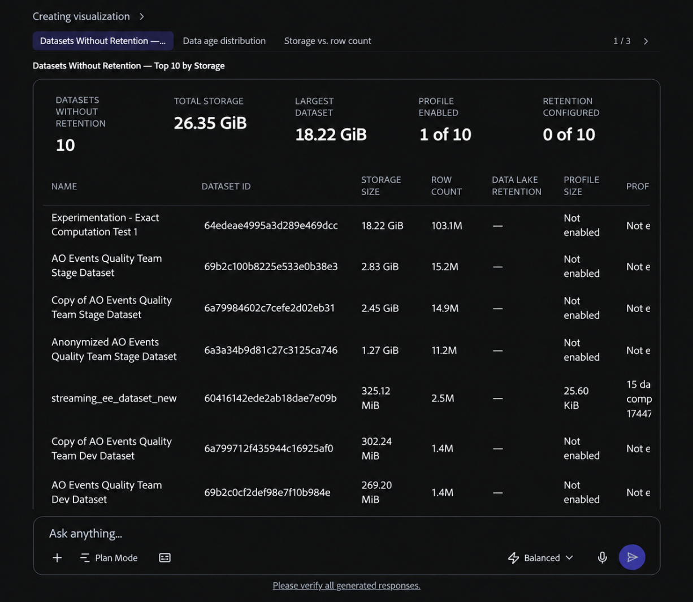

# データレイクの管理

CX Coworkerを使用して、サンドボックス内のエクスペリエンスイベント データの価値を把握し、最適化から恩恵を受ける可能性のあるデータを特定します。 サンドボックスのデータの最適化やデータセットのクリーンアップをCoworkerに依頼するなど、幅広いリクエストから始めることができます。 Coworkerは、Data Management Agentを使用して、調査する価値のあるデータセットを抽出し、データセットがどの程度積極的に使用されたかを分析し、保持期間の影響をモデル化し、必要に応じてデータレイクの保持ポリシーの管理を支援します。

## 始める前に {#before-you-begin}

確認したいデータセットが含まれているサンドボックスで作業していることを確認します。 また、Data Management Agentと必要なAdobe Experience Platform権限へのアクセス権も必要です。 [Data Management Agentの前提条件](../../../../agents/data-management.md#prerequisites)を参照してください。

## サンドボックス内のデータを最適化 {#optimize-data-in-your-sandbox}

これらのスキルをワークフローとして組み合わせることで、 データの価値の把握、サンドボックスでのデータの最適化など、幅広いデータ管理目標から始めます。 Coworkerは、調査する価値のあるデータセットの検索、データセットの使用状況の確認、潜在的な保持期間の影響のモデル化を支援します。そして、行動する準備ができたら、保持ポリシーを設定、変更、削除します。

### 最適化する価値のあるデータの発見 {#find-data-worth-optimizing}

どこから始めるかを決めるには、同僚に調査する価値のあるエクスペリエンスイベント データセットを特定してもらいます。 データ、データ最適化、データセットのクリーンアップなどがもたらす価値について、幅広く質問することから始めましょう。 リストデータセットスキルを使用して、ストレージサイズ、行数、既存の保持ステータス、プロファイルの有効化を確認します。 データセットサイズ、行数、最近のアクセスなどの条件で結果をフィルタリングし、リストを絞り込むことができます。 スキルは読み取り専用です。 Coworkerは、スキャンして比較できるテーブルと、サイズ、行数、データ年齢でデータセットをハイライト表示するビジュアライゼーションを返します。

リストを絞り込んだら、データセットの使用状況を分析スキルを使用して、特定のデータセットがどの程度積極的に使用されているかを確認します。

このスキルで表示された未使用のデータセットや放棄されたデータセットがすべて、データレイクの保持ポリシーの候補になるわけではありません。 データセット全体を削除したり、別のExperience Platform ストアでデータを管理したりする必要がある場合は、[適切なデータライフサイクル管理機能の選択](https://experienceleague.adobe.com/ja/docs/experience-platform/data-lifecycle/choose-a-capability)を参照してください。 データレイク保持ポリシーを設定する前に、データセットがExperience Event データセットであることを確認します。

プロンプトの例：

- 「自分のデータを最適化できる感覚があります。」
- 「私のデータの価値を理解するのに役立ちます。」
- 「サンドボックスデータを最適化する」
- 「サンドボックスのデータセットをクリーンアップする」
- 「最大のイベントデータセットを表示してください」
- 「データレイクの保持セットが設定されていない100 GBを超えるデータセットを表示する」
- 「約2TBのデータを削除する必要があります。 どこから始めればいいですか？」
- 「孤立した、放棄された、または未使用のデータを見つけるのを手伝ってもらえますか？」
- 「過去90日間にアクセスされていないデータセットを優先する」

### データセットがどの程度積極的に使用されているかを確認する {#check-how-actively-a-dataset-is-used}

データセットがデータレイクの保持ポリシーの候補として適しているかどうかを判断する前に、データセットがどの程度積極的に使用されているかを確認します。 データセット使用を分析スキルを使用して、複数の使用シグナルにわたって特定のデータセットを評価します。 これらのシグナルには、最近の取り込みアクティビティ、クエリアクティビティ、スキーマの安定性、データセットが他のAdobe Experience Platformアプリケーションにフィードしているかどうかが含まれます。 スキルは読み取り専用です。 Coworkerは、全体的な使用状況レベル、シグナルの内訳、データセットについて示しているものの平易な言語での要約を返します。

<!-- TODO: Confirm the final usage-tier thresholds with engineering after the planned update from a 7-day to a 30-day analysis window is complete. Update this section with the final definitions before publishing. -->

>[!NOTE]
>
>ここに示す指標は、有益なシグナルを提供することを目的としており、意思決定に関連するすべての要因を表しているわけではありません。 アクションを実行する前に、利用可能な詳細を確認し、ビジネスコンテキストを適用することをお勧めします。

プロンプトの例：

- 「Web イベントデータセットはどの程度積極的に使用されていますか？」

### 保持期間の影響をモデル化する {#model-the-impact-of-a-retention-period}

特定の保持期間にコミットする前に、保持または削除されるデータの量を確認します。 データセットの保持スキルを分析を使用して、データセットのストレージ指標とデータの年齢分布を確認します。 そして、その分布を利用して、提案された保持期間がどれだけデータを保持または削除するかをモデル化します。 Coworkerは、行数とストレージサイズ別に推定される影響を示します。

スキルは読み取り専用です。 Coworkerは、データの経過時間と影響分析を会話で直接返します。これにより、結果をデータセットの現在の保持設定と比較してから、変更するかどうかを決定できます。

プロンプトの例：

- 「このデータセットに60日間の保持期間を設定した場合、どのような影響があるでしょうか？」

### リテンションポリシーの設定、変更、削除 {#set-change-or-remove-a-retention-policy}

>[!IMPORTANT]
>
>データレイクの最小保持期間は30日です。 短い期間はサポートされていません。

保持期間を決定したら、データセットの管理の保持スキルを使用して、データセットのデータレイクリテンションポリシーを設定、変更、削除します。 このスキルは、変更を適用する前に、提案された影響を示します。 ポリシーは、リクエストを明示的に承認した後にのみ適用されます。 変更を記述しても、その変更は適用されません。

リテンションポリシーを確定した後、Adobe Experience Platform UIに変更内容が表示されるまでに短い時間がかかる場合があります。 リテンションポリシーは、期限切れのデータを直ちに削除しません。 最初のリテンションジョブは、ポリシーが適用されてから24時間以内に開始されます。 最初の実行後、スケジュールされたジョブは、30日ごとに期限切れのレコードを評価して削除します。 保持とパージについて詳しくは、[Experience Event データセット保持（TTL）ガイド &#x200B;](https://experienceleague.adobe.com/ja/docs/experience-platform/catalog/datasets/experience-event-dataset-retention-ttl-guide)を参照してください。

リテンションポリシーの変更はすべて、ポリシーの設定、変更、削除などのタイミングを含む監査証跡に記録されます。 監査記録には、各変更を行ったユーザー、変更が行われた日時、変更された内容が記録されます。 Coworkerが提供するリンクに従って、Adobe Experience Platformのデータセットの「監査ログ」タブでこれらのイベントを確認できます。 詳しくは、[監査ログの概要](https://experienceleague.adobe.com/ja/docs/experience-platform/landing/governance-privacy-security/audit-logs/overview)を参照してください。

タイムスタンプ、ユーザー、データセット、アクション、ステータスなど、データレイク保持ポリシーの更新を示す

プロンプトの例：

- 「このデータセットのリテンションを60日に設定します。」
- 「このデータセットの保持ポリシーを削除します。」

## ベストプラクティス {#best-practices}

Data Management Agentを使用する場合は、次の点に注意してください。

- **幅広い目標から始めます。** どのデータセットに注意を払う必要があるかわからない場合は、Coworkerに質問して、データの価値を理解したり、サンドボックス内のデータを最適化したりしてもらいましょう。 「データセットのリスト」スキルを使用して、個々のデータセットを分析する前に、最近の使用回数が少ないまたは少ないことを示すシグナルを含むデータセットを特定します。
- **確認する前に、影響プレビューを確認してください。** リテンションの変更を承認する前に、何を保持および削除するかを確認します。
- **変更内容を表示する時間を許可します。** CX Coworkerでリテンションの変更を確定したら、Adobe Experience Platform UIに変更内容が反映されるまでの時間を短くします。

## 次の手順 {#next-steps}

Data Management Agentのスキル、スコープ、動作および制限について詳しくは、[Data Management Agentの概要](../../../../agents/data-management.md)を参照してください。 Adobe Experience Platformでのデータレイク保持ポリシーの仕組みについて詳しくは、[Experience Event データセット保持（TTL）ガイド &#x200B;](https://experienceleague.adobe.com/ja/docs/experience-platform/catalog/datasets/experience-event-dataset-retention-ttl-guide)を参照してください。
